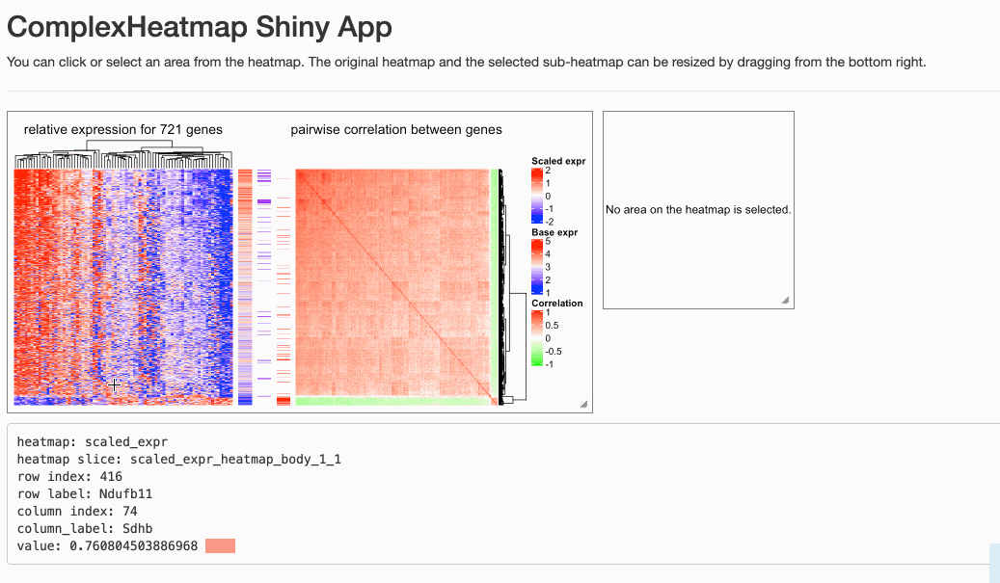

```{r, echo = FALSE}
library(knitr)
knitr::opts_chunk$set(
    error = FALSE,
    tidy  = FALSE,
    message = FALSE,
    warning = FALSE,
    fig.align = "center"
)
library(InteractiveComplexHeatmap)
```

<style>
p {
    margin: 1em 0;
}
</style>

The **InteractiveComplexHeatmap** package is very straightforward to use. For
any heatmap (or list of heatmaps as a `Heatmap` or `HeatmapList` object)
produced from **ComplexHeatmap** package, you just use the function
`ht_shiny()` to export it as a Shiny app.

You can copy and paste the following code:

```{r, eval = FALSE}
library(InteractiveComplexHeatmap)
m = matrix(rnorm(100*100), nrow = 100)
ht = Heatmap(ht)
ht = draw(ht) # not necessary, but recommended

ht_shiny(ht)
```

A link will be opend in your web browser automatically (or a pop-up window in RStudio IDE).

To use `ht_shiny()`, the `Heatmap`/`HeatmapList` object is not necessary to be
updated with `draw()` and it will be applied inside `ht_shiny()`
automatically. However, updating by `draw()` will speed up the loading of the
Shiny app because `draw()` applies clustering (which is normally the most
time-consuming part) and the clustering results are saved the heatmap object.
If your heatmap includes randomness, such as k-means clustring by setting
`row_km` or `column_km` argument, then you must execute `draw()` before
sending to `ht_shiny()`.


Following screenshot demonstrates the Shiny app on rather complex heatmaps.
The data is from
[here](http://jokergoo.github.io/supplementary/ComplexHeatmap-supplementary1-4/supplS2_scRNASeq/supplS2_scRNAseq.html)
with slightly changing the original code for making heatmaps.

In this Shiny app, users can click on the orignal heatmap or select an area
from it. The information of the area selected by users can be found in the
text below the heatmaps. If an area is selected, the row and column indices
for all selected heatmaps can be obtained from a automatically generated
sourcable code, which can also be found below the heatmap. Both heatmaps can
be resized by dragging from the bottom right.

<p></p>

Please note, if the heatmap is too huge or you resize the heatmap too
frequently, the heatmap might not be correctly updated. You can just slightly
resize the heatmap again and wait for several seconds (you might have already observed
from the previous screenshot that the right heatmap was not properly drawn when I first
resized it).

There are two other vignettes focusing on more specific topics:

- [How interactive ComplexHeatmap is implemented](implementation.html)
- [Functions for Shiny app development](shiny_dev.html)


## Live examples

The following code demostrates two horizontally concatenated heatmaps. Check
Please visit https://jokergoo.shinyapps.io/interactive_complexheatmap/ for a live demo.

```{r, eval = FALSE}
set.seed(123)
mat1 = matrix(rnorm(100), 10)
rownames(mat1) = colnames(mat1) = paste0("a", 1:10)
mat2 = matrix(sample(letters[1:10], 100, replace = TRUE), 10)
rownames(mat2) = colnames(mat2) = paste0("b", 1:10)

ht_list = Heatmap(mat1, name = "mat_a", row_km = 2, column_km = 2) +
    Heatmap(mat2, name = "mat_b")
```

The following code demostrates two vertically concatenated heatmaps. Check
https://jokergoo.shinyapps.io/interactive_complexheatmap_vertical/ for a live demo.

```{r, eval = FALSE}
ht_list = Heatmap(mat1, name = "mat_a", row_km = 2, column_km = 2) %v%
    Heatmap(mat2, name = "mat_b")
ht_shiny(ht_list)
```

`ComplexHeatmap::densityHeatmap()` returns a `Heatmap` object, so it can also be exported into a Shiny app.
Check https://jokergoo.shinyapps.io/interactive_densityheatmap/ for a live demo.

```{r, eval = FALSE}
ht = densityHeatmap(mat1)
ht_shiny(ht)
```

[**EnrichedHeatmap**](https://www.bioconductor.org/packages/release/bioc/html/EnrichedHeatmap.html)
also outputs `Heatmap` objects, thus, an "enriched heatmap" can be exported
into a Shiny app as well. Check
https://jokergoo.shinyapps.io/interactive_enrichedheatmap/ for a live demo.

```{r, eval = FALSE}
library(EnrichedHeatmap)
load(system.file("extdata", "chr21_test_data.RData", package = "EnrichedHeatmap"))
mat_meth = normalizeToMatrix(meth, cgi, value_column = "meth", 
  mean_mode = "absolute", extend = 5000, w = 50, smooth = TRUE)
ht = EnrichedHeatmap(mat_meth, name = "methylation", 
  column_title = "methylation near CGI")
ht_shiny(ht)
```

Since **ComplexHeatmap** can [seamlessly integrate **pheatmap**](https://jokergoo.github.io/2020/05/06/translate-from-pheatmap-to-complexheatmap/), this means your pheatmap can be interactive!

```{r, eval = FALSE}
ht = pheatmap(mat1)
ht_shiny(ht)
```

## Examples shipped with the package

There are many examples in the package which ...


```{r}
ht_shiny_example()
```

<br />
<br />
<br />
<br />
<br />
<br />
<br />
<br />