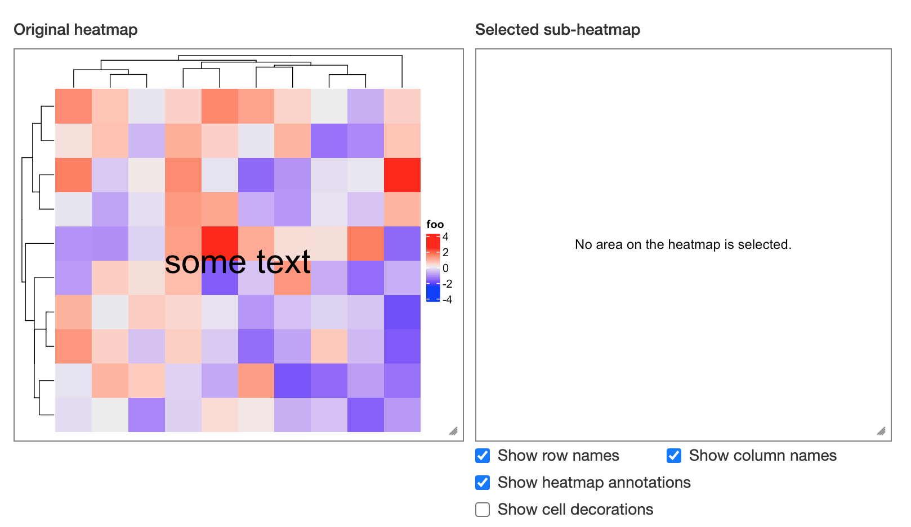

In **ComplexHeatmap**, we use `decorate_*()` function to add graphics after
the heatmap are drawn. To also put the decoration graphics in the heatmaps in
the Shiny app, you need to wrap all the decoration code into a function and
send it to `post_fun` argument in `draw()` function. For example, the following
code to generate a decorated heatmap:

```r
library(ComplexHeatmap)
m = matrix(rnorm(100), 10)
ht = Heatmap(m, name = "foo")
ht = draw(ht)
decorate_heatmap_body("foo", {
	grid.text("some text", gp = gpar(fontsize = 30))
})
```

To export it as a Shiny app also with decorations, the code needs to be slightly 
adjusted as:

```r
library(InteractiveComplexHeatmap)
post_fun = function(ht_list) {
	decorate_heatmap_body("foo", {
		grid.text("some text", gp = gpar(fontsize = 30))
	})
}
ht = draw(ht, post_fun = post_fun)
ht_shiny(ht)
```


