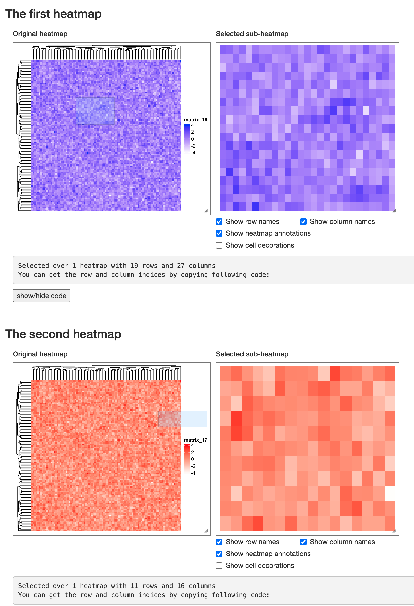

<style>
p {
    margin: 1em 0;
}
</style>

```{r, echo = FALSE}
library(knitr)
knitr::opts_chunk$set(
    error = FALSE,
    tidy  = FALSE,
    message = FALSE,
    warning = FALSE,
    fig.align = "center"
)
```

`ht_shiny()` can export heatmaps as a stand-alone Shiny app. **InteractiveComplexHeatmap** also provides two
functions for integrating the interactive heatmap components into other Shiny apps. The two functions are:

- `InteractiveComplexHeatmapOutput()`: for building UI.
- `MakeInteractiveComplexHeatmap()`: for the processing on the sever side.

The usage is simple. Following is an example that you can directly copy and paste to your R session.

```r
library(InteractiveComplexHeatmap)
library(shiny)

m = matrix(rnorm(100*100), nrow = 100)
ht = Heatmap(m)
ht = draw(ht)

ui = fluidPage(
    h3("My first interactive ComplexHeatmap Shiny app"),
    InteractiveComplexHeatmapOutput()
)

server = function(input, output, session) {
    MakeInteractiveComplexHeatmap(ht, input, output, session)
}

shinyApp(ui, server)
```


You can also put multiple interactive heatmaps in a single Shiny app, but this time you must assign a "heatmap id" for each one,
so that `MakeInteractiveComplexHeatmap()` can find the correct heatmap to response. The heatmap id should start with letters.

```r
ht1 = Heatmap(m, col = c("white", "blue"))
ht1 = draw(ht1)
ht2 = Heatmap(m, col = c("white", "red"))
ht2 = draw(ht2)

ui = fluidPage(
    h3("The first heatmap"),
    InteractiveComplexHeatmapOutput("heatmap_1"),
    hr(),
    h3("The second heatmap"),
    InteractiveComplexHeatmapOutput("heatmap_2")
)

server = function(input, output, session) {
    MakeInteractiveComplexHeatmap(ht1, input, output, session, "heatmap_1")
    MakeInteractiveComplexHeatmap(ht2, input, output, session, "heatmap_2")
}

shinyApp(ui, server)
```



## Work with R Markdown documents

## Self-define output

